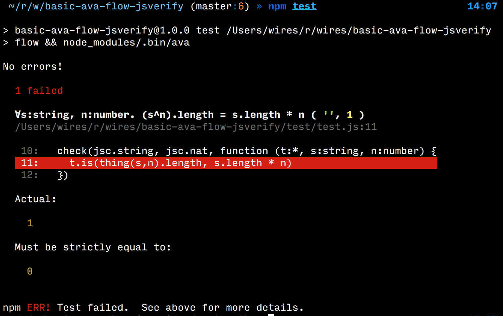

# Summary

Example repo to demonstrate type checking and property based testing of
JS code.

Source file looks like this

```js
// @flow

// just some dumb code for the flow checker to work on
module.exports function (s:string, n:number) : string {
	var x:string = ''
	for (var i = 0; i < n; i++) x += s
	return x
}
```

Test looks like this

```js
// @flow
const test:* = require('ava')
const jsc:* = require('jsverify')
const check:* = require('ava-jsverify').check

const thing:* = require('../index.js')

test('∀s:string, n:number. (s^n).length = s.length * n',
	check(jsc.string, jsc.nat, function (t:*, s:string, n:number) {
		t.is(thing(s,n).length, s.length * n)
	})
)
```

If the test fails, `ava` shows you what is up:



# Why

We want type checking and correctness proofs but the JS language
is not really suited for this.

One could use a language that is better suited for such coding,
like [Rust](), [Purescript](http://purescript.org) or [Idris](http://idris-lang.org).

While these language compile to JS, there some downsides to this approach
in terms of extra overhead.

Using a type checker and property based testing of JS code, we can get
pretty far while still writing *"Vanilla JS"*.

# What

- [ava](https://github.com/avajs/ava) is a test runner,
  with [TAP](https://testanything.org/) output and other fancy shit

- [flow](https://flow.org/) is a type checker for JS

- [jsverify](https://github.com/jsverify/jsverify) is a
  [QuickCheck](https://en.wikipedia.org/wiki/QuickCheck)-like property
  based testing tool (generates randomised test-cases and checks if property holds)

- [babel](https://babeljs.io/) is a js-to-js compiler, used to compiled JS with
  modern features to oldschool JS for runtimes that do not support newer JS syntax.

# How

We instruct babel to strip the flow annotations from the sources using the
[`.babelrc`](./.babelrc) file,

```json
{
	"plugins": [
		"transform-flow-strip-types"
	]
}
```
([reference](https://babeljs.io/docs/plugins/transform-flow-strip-types/))


To have `ava` process *both* our tests and source files with babel,
we add a section to [`package.json`](./package.json)

```json
{
  "ava": {
    "require": "babel-register",
    "babel": "inherit"
  }
}
```
([reference](https://github.com/avajs/ava/blob/master/docs/recipes/babelrc.md#transpiling-tests-and-sources-the-same-way)).

# Flow stubs

Many libraries don't have flow type annotations or typing bugs that
the flow type checker will run into. To work around this, we exclude
the module and provide a stub.

To exclude modules we modify [.flowconfig](./.flowconfig).

```ini
[ignore]
; exclude some problematic JS module
./node_modules/jsverify/.*

[libs]
; load file containing our replacement stubs
./.stubs.js.flow

[options]
module.name_mapper='jsverify' -> 'jsverify'
```

([reference](https://flow.org/en/docs/config/options/#toc-module-name-mapper-regex-string))

We place module definitions in [`.stubs.js.flow`](./.stubs.js.flow)

```
declare module jsverify {
  declare var exports : *
}
```
